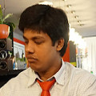
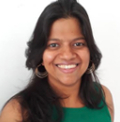
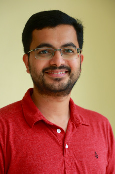
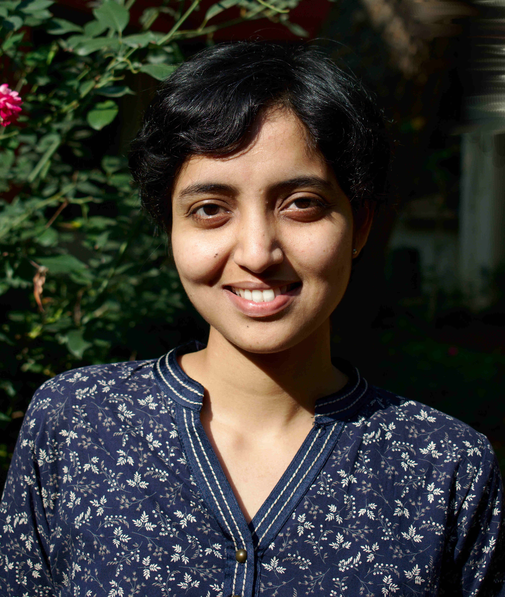
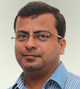
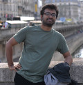
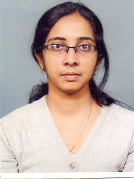
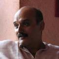
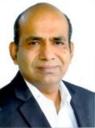
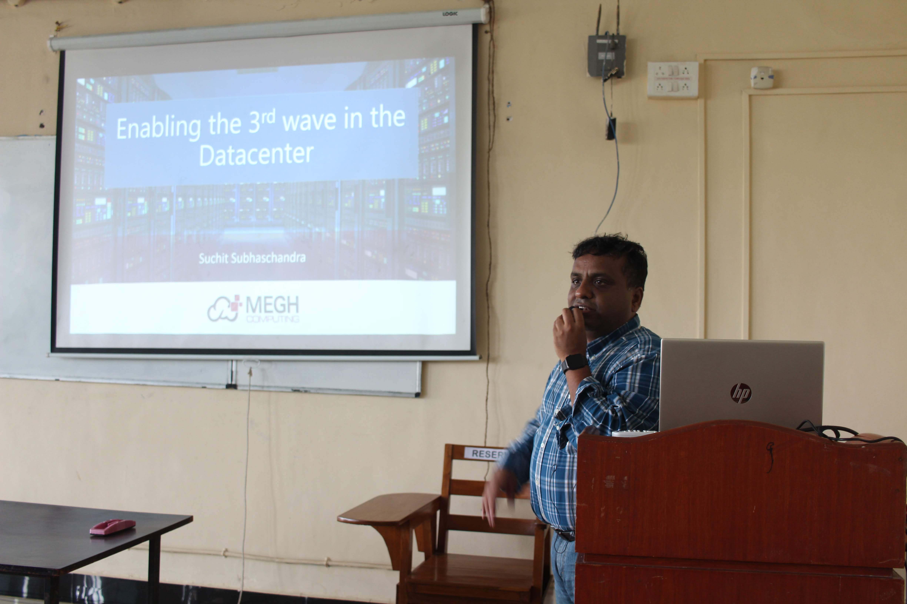

Vision & Mission
============

_The CSE department at IIT Goa envisages to become one of the top three CS departments in the country for research in the foundational areas of Computer Science and Systems._

Its mission includes:

 + _Implement and disseminate research-based instructional strategies in computer science training at all levels._
+ _Develop, promote and disseminate the use of free/ open-source software in engineering education._

Academic Programs
========

### B.Tech. ###

B.Tech. program in Computer Science and Engineering started in Autumn 2016. The current in-take in B.Tech. CSE is XXX. At the moment there are in total XXX students in the B.Tech. CSE programme.

The department, in collaboration with Department of Mathematics, is offering a B.Tech. Programme in Maths & Computing. The current in-take of B.Tech. M&C is XXX. The Programme has in total XXX students.

### M.Tech. ###

The M.Tech. program in CSE started in Autumn 2019. Currently the M.Tech. programme has 8 students.

### Ph.D. ###

The Ph.D. program in Computer Science & Engineering started in Autumn 2018. Admissions are held twice in a year. Currently the department has 6 full time and 2 partime PhD students.

Research
=========

The research happening at IIT Goa can be broadly categorised into the following groups.

### Hardware Systems

**Members** Dr. Neha Karanjkar, Dr. Sharad Sinha, Dr. Ravi Mittal

The focus areas are Computer Networks, Computing  Architecture, Reconfigurable Computing (FPGA, High Level Synthesis), Computing hardware for AI, Computer Security, and Applications of Computing in Medical Devices and Marine Technology Domains.

### Machine learning

**Members** Dr. Clint P. George

Focus areas are Topic models, Marine data science, and Learning Strategies.

### Software Systems

**Members** Dr. Neha Karanjkar, Dr. Sudakshina Dutta.

The focus areas are Internet of Things, System Modeling and Discrete-event simulation, Software verification, Compilers, and Static Analysis and Debugging.

### Theoretical Computer Science

**Members** Dr. Amaldev Manuel,  Dr. Arpita Korwar, Prof Milind Sohoni, Prof Somenath Biswas, Dr. Sreejith AV. 

The focus areas are Algorithms, Computational Complexity, Arithmetic Complexity, Logic in Computer Science, Formal Methods, Automata Theory
Semigroup theory, and Functional Programming.

Members
=======

### Dr. Amaldev Manuel

Assistant Professor 

amal@iitgoa.ac.in

Research Interests: 
Automata theory, Logic in Computer Science, Semigroup theory

PhD Degree Institution: 
Institute of Mathematical Sciences, Chennai (HBNI)

### Dr. Arpita Korwar

Assistant Professor 

arpita@iitgoa.ac.in

Research Interests: 
Arithmetic complexity, Algebra

PhD Degree Institution: 
IIT Kanpur

### Dr. Clint P. George

Assistant Professor 

clint@iitgoa.ac.in

Research Interests: 
Machine learning, applied statistics, data science and applications in text mining, marine data science, education data, and cancer genomics 

PhD Degree Institution: 
University of Florida, U.S.A. 

Externally Funded Project(s):
2017-2018 SEED Grant, Office of Research, University of Florida, role as Co-PI with Co-PIs J. J. Hamlin (Physics), A. Linscheid (Physics), P. J. Hirschfeld (Physics), and R. G. Hennig (Materials Sciences), work continued here. 
NVIDIA GPU Teaching Grant for the CS 360 class

### Dr. Neha Karanjkar

Assistant Professor 

nehak@iitgoa.ac.in

Research Interests: 
Modeling, Simulation and Optimization of Discrete-event Systems, Computer Architecture, Embedded Systems, Smart-City IoT systems

PhD Degree Institution: 
Indian Institute of Technology Bombay 

Date of Joining IIT Goa: 
January 2019

### Dr. Sharad Sinha

Assistant Professor 

sharad@iitgoa.ac.in

Research Interests:
Computer Architecture, Computing Systems Design, Reconfigurable Computing, High Performance Embedded Computing, Applications of Computing (Medical Devices, Assistive Technologies), Computing Systems Security

PhD Degree Institution: 
Nanyang Technological University (NTU), Singapore (2009-2013)

Externally Funded Project(s): 
Indo French DST-INRIA-CNRS Joint Call, 2019 
Amazon AWS Educate Teaching Grant, 2019

### Prof. Somenath Biswas

Distinguished Visiting Professor 

sb@iitgoa.ac.in

Research Interests:
Computational Complexity theory, randomized algorithms, computational biology, logic in computer science 

### Dr. Sreejith AV

Assistant Professor 

sreejithav@iitgoa.ac.in

Research Interests: 
Logic, Verification, Automata theory, 

PhD Degree Institution: 
Institute of Mathematical Sciences, Chennai (HBNI)

Externally Funded Project(s): 
MoES funded project

### Dr. Sudakshina Dutta

Assistant Professor 

sudakshina@iitgoa.ac.in

Research Interests:
Formal Verification, Static analysis 

PhD Degree Institution:
IIT Kharagpur

Visiting Faculty
-----------------

### Prof. Milind Sohoni

Visiting Professor

sohoni@cse.iitb.ac.in

Research Interests:
Combinatorial Optimization, Mathematical Programming, Algorithms

PhD Degree Institution:
IIT Bombay

### Dr. Ravi Mittal

Visiting Professor

ravi.mittal@iitgoa.ac.in

Research Interests:
Computer networks, Security

Adjunct Faculty
---------------

### Prof. Nisheeth K. Vishnoi

Visiting Professor

nisheeth.vishnoi@gmail.com

Research Interests:
Computer Science & Engineering
Approximability of NP-hard problems, Combinatorial, Convex and Non-convex Optimization and Sampling, Algorithmic questions involving dynamical systems, Stochastic processes and polynomials.

Publications
=========

Details of the research publications and patents appeared of faculty members in the year 2019-20.

1. Paul Gastin, Amaldev Manuel, R. Govind: Logics for Reversible Regular Languages and Semigroups with Involution. DLT 2019: 182-191
2. Analyses of Multi-collection Corpora via Compound Topic Modeling. P. George, C., Xia, W., and Michailidis, G. (2019). The Fifth International Conference on Machine Learning, Optimization, and Data Science, Siena – Tuscany, Italy.
3. HL-Pow: A Learning-Based Power Modeling Framework for High-Level Synthesis, Zhe Lin , Jieru Zhao , Sharad Sinha , Wei Zhang
25th Asia Pacific Design Automation Conference (ASP-DAC 2020), 2020, Beijing, China, pp. 574-580.
4. iGPU Leak: An Information Leakage Vulnerability on Intel Integrated GPU, Wenjian He , Wei Zhang , Sharad Sinha , Sanjeev Das, 25th Asia and South Pacific Design Automation Conference (ASP-DAC 2020), 2020, Beijing, China, pp. 568-573.
5. Optimization of Convolutional Neural Networks on Resource Constrained Devices, Arish Sateesan , Sharad Sinha , Smitha K.G.
IEEE Computer Society Annual Symposium on VLSI (ISVLSI 2019), 2019, Miami, USA, pp. 19-24.
6. An Ensemble Learning Approach for Monitoring of FPGA Dynamic Power, Zhe Lin , Sharad Sinha , Wei Zhang, IEEE Transactions on Computer-Aided Design of Integrated Circuits and Systems (IEEE TCAD: vol. 38, issue 9), 2019, New York, USA, pp. 1661-1674.
7.  Smart Nation: Indoor Navigation for the Visually Impaired, Boon Leng Lim , Smitha Kavallur Pisharath Gopi , Sharad Sinha, 4th International Conference on Intelligent Transportation Engineering, 2019, Singapore, pp. Published.
8. Smart Nation: Offline Public Transport Made Easy, Ang Poh Keong , Smitha Kavallur Pisharath Gopi , Sharad Sinha
4th International Conference on Intelligent Transportation Engineering, 2019, Singapore, pp. Published.
9.  Performance Modeling and Directives Optimization for High Level Synthesis on FPGA, Jieru Zhao , Liang Feng , Sharad Sinha , Wei Zhang , Yun Liang , Bingsheng He, IEEE Transactions on CAD (TCAD), 2019, New York, pp. Published.
10. LAMA: Link-Aware Hybrid Management for Accesses in Emerging CPU-FPGA Platforms, Liang Feng , Jieru Zhao , Tingyuan Liang , Sharad Sinha , Wei Zhang, IEEE/ACM Design Automation Conference (DAC) 2019, 2019, Las Vegas, pp. 1-6.
11. Machine Learning Based Routing Congestion Prediction in FPGA High-Level Synthesis, Jieru Zhao , Tingyuan Liang , Sharad Sinha , Wei Zhang
Design Automation and Test in Europe (DATE 2019), 2019, Florence, Italy, pp. 1130-1135.
12. Towards Efficient and Scalable Acceleration of Online Decision Tree Learning on FPGA, Zhe Lin , Sharad Sinha , Wei Zhang, 27th IEEE International Symposium on Field-Programmable Custom Computing Machines (FCCM 2019), 2019, San Diego, USA, pp. 172-180. 

Professional Activities by Members
==========================

General/Program/Track/Session Chairmanship at Conferences:

* Dr. Amaldev Manuel, Program Committee Member, FSTTCS 2020.
* Dr. Sharad Sinha, Editor-in-Chief, IEEE Potentials (2020, 2021).
* Dr. Sharad Sinha, Organizing Chair, Arm and SMDP-C2SD (MeitY, Govt. of India) Faculty Development Program on Arm Architecture and System on Chip Design, December 1-3, 2019.
* Dr. Sudakshina Dutta, Co-organizer, ACM-W Regional Celebration of Women in Computing.
* Dr. Sudakshina Dutta, Session Chair, CINE 2020, ISI calcutta.

Editorship:

* Sharad Sinha, Editor-in-Chief, IEEE Potentials (2020, 2021)

External PhD Supervisor:

* Sharad Sinha,  Department of Electronic and Computer Engineering, Hong Kong University of Science and Technology (HKUST), Hong Kong (May 2020-)

Departmental Events
================

Talks 
-------------------

* Dr. C. Aiswarya, Chennai Mathematical Institute, 'Weighted Tiling Automata on Graphs: Evaluation Complexity', 10 March 2020.
* Prof. Manindra Agarwal, IIT Kanpur, 'Polynomial Identity Testing', 17 Feb 2020.
* Dr. Vincent Penelle, University of Bordeaux, ' Rewriting Higher-order Stack Trees', 13 Dec 2019.
* Parshu Ram Dhungyel, Royal University of Bhutan, 'Bhutan, Its Education System and Protecting the Dzongs', 5 Dec 2019.
* Dr. Pratiti Bhadra, University of Saarland, ' A machine learning approach to predict antimicrobial protein', 20 Nov 2020.
* Prof. V V Kamat, Goa University, 'Quest for Visual Realism in Computer Graphics, Modeling Shape and Motion', 13 Nov 2020.
* Dr. Kanchan Manna, BITS Pilani (Goa), 'Thermal-aware Application Mapping Strategy for Network-On-Chip based System', 5 Nov 2020.
* Prasanna Kumar, IIITB,  'Dependence Analysis of Functional Programs and its Applications', 1 Nov 2020.
* Suchit Subhaschandra, Megh Computing Inc., 'Recent developments in computer systems design for data analytics', 21 Aug 2019.

Invited Talks by Faculty Members
---------------------------------------------

* Dr. Amaldev Manuel, 'Teaching for 21st Century Problems', Dr Dada Vaidya College of Education, Ponda, 13 March 2020.
* Dr. Amaldev Manuel, 'TeX and Typesetting', Debutsav 2019, GEC Farmagudi.
* Dr. Clint P. George, 'Introduction to Machine Learning', Don Bosco College of Engineering, Goa, 8 February 2020.
* Dr. Neha Karanjkar, 'SimPy for discrete event simulations', Debutsav 2019, GEC Farmagudi.
* Dr. Neha Karanjkar, 'Scalable and Expressive Simulation Frameworks for IoT-enabled Maritime Applications', Cefipra GOAT workshop, Brest, France, 25 January 2020
* Dr. Sharad Sinha, 'Artificial Intelligence for All using R Programming Language', Don Bosco College of Engineering, Goa, 8 February 2020.

Memorandums of Understanding Signed
---------------------------------------------------------

*  Megh Computing Inc.,  21 Aug 2019.
* Chennai Mathematical Institute, 30 July 2019.

Seminars/Workshops
----------------------------------------

1. **Artificial Intelligence for All Using R Programming Language**  Workshop organized on August 31, 2019 and financially sponsored ACM Special Interest Group on AI through its AI Outreach Grant. 40 high school students from six schools in Ponda, Goa participated along with their teachers. Workshop outcome was also published in ACM SIGAI publication AI Matters, volu. 5, issue 4, Dec. 2019. Workshop was coordinated by Dr. Sharad Sinha and Dr. Clint P. George with the support of PhD students in CSE.

2. **Artificial Intelligence for All Using R Programming Language**  Talk was given by Dr. Sharad Sinha and Dr. Clint P. George for Class XI-XII students at SSVM School, Kavle, Ponda, September 27, 2019.

3. **Faculty Development Program on Arm Architecture and System on Chip Design**  The FDP was organized December 1-3, 2019 with the support of Arm Education Program and the Special Manpower Development Program for Chips to System Design (SMDP-C2SD) of the Ministry of Electronics and IT, Govt. of India. Faculty members from several IITs, NITs and regional engineering colleges participated in this. Mr. Ish Dham, Distinguished Engineer, Arm and Dr. Akshay Visweswaran, IMEC, Belgium were the keynote speakers. Dr. Sharad Sinha from CSE was the Organizing Chair and Apurva Varma from Arm was the Co-Chair. M.Tech and PhD students in CSE helped in the conduct of the FDP.

4. **Artificial Intelligence for All Using R Programming Language Workshop**  A workshop for faculty members from the Mechanical Engineering department of Don Bosco College of Engineering, Fatorda, Goa was conducted on their premises by Dr. Sharad Sinha and Dr. Clint P. George on February 8, 2020.

5. **GOAT Workshop** The Department of CSE was represented by Dr. Sharad Sinha and Dr. Neha Karanjkar in the GOAT Workshop on Marine Science held January 20-23 in Brest France. Dr. Sharad gave a talk on "Design of Computational Hardware and Software for Autonomous Navigation at Sea" while Dr. Neha gave a talk on "Scalable and Expressive Simulation Frameworks for IoT-enabled Maritime Applications".

6. A talk was given by Mr. Suchit Subhaschandra, Co-Founder of Megh Computing, USA on September 2, 2019. The title of his talk was "Enabling the 3rd Wave in the Data Center." ACM Student Chapter volunteers helped in the conduct of the talk.

7. The Department of CSE hosted Prof. Manindra Agarwal, N. Rama Rao Chair Professor, Computer Science and Engineering and Deputy Director, IIT Kanpur on February 17, 2020. He gave an Institute Lecture on "Polynomial Identity Testing".

8. The Department of CSE hosted Mr. Parshu Ram Dhungyel, Faculty Member from Royal University of Bhutan under the India Science Research Fellowship 2019 under the mentorship of Dr. Sharad Sinha. He spent time in IIT Goa working on fire detection and alarm strategies for Dzongs in Bhutan. He also gave a talk on this during his stay.

